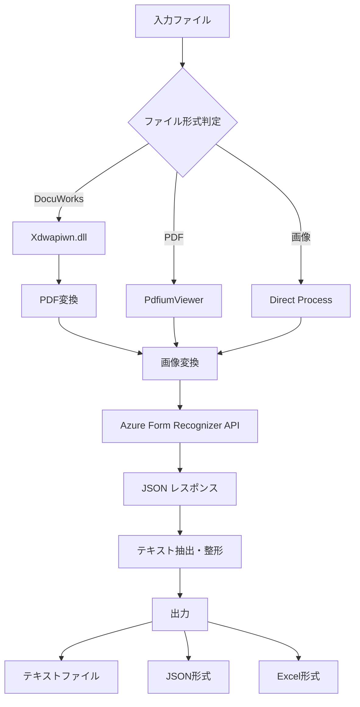

# Asahi AIdeep TaxLawyer328 技術仕様書
## Technical Specification Document

---

## 1. システム概要 (System Overview)

**製品名**: Asahi AIdeep TaxLawyer328  
**用途**: 税務関連書類のOCR処理およびテキスト抽出システム  
**プラットフォーム**: Windows (.NET Framework 4.7.2)  
**アーキテクチャ**: WPFデスクトップアプリケーション + コンソールインターフェース

### 主要機能
- 多様な文書フォーマットからのテキスト抽出
- DocuWorks形式ファイルの処理
- PDFファイルの処理
- 画像ファイルのOCR処理
- 構造化データ（JSON）での出力
- 固定資産税課税明細書などの定型帳票処理

---

## 2. 技術スタック (Technology Stack)

### 2.1 フレームワークとランタイム
- **.NET Framework**: 4.7.2
- **UI Framework**: WPF (Windows Presentation Foundation)
- **UIライブラリ**: 
  - MaterialDesignThemes.Wpf (v9.5MB)
  - MahApps.Metro (v3.5MB)
  - Microsoft.Xaml.Behaviors

### 2.2 主要ライブラリ

| ライブラリ | 用途 | 詳細 |
|-----------|------|------|
| **Xdwapiwn.dll** | DocuWorks処理 | 富士ゼロックス公式API |
| **PdfiumViewer.dll** | PDF表示・処理 | Google Pdfiumベース |
| **PdfSharp.dll** | PDF生成・編集 | オープンソースPDFライブラリ |
| **Newtonsoft.Json** | JSON処理 | データシリアライゼーション |
| **NLog.dll** | ログ記録 | 構造化ログ出力 |
| **SpreadsheetLight.dll** | Excel処理 | Excel形式での出力 |
| **DocumentFormat.OpenXml** | Office文書処理 | Open XML SDK |

### 2.3 OCRエンジン
- **Azure Form Recognizer API**
  - API Version: 2022-01-30-preview
  - Model: prebuilt-layout
  - 機能: レイアウト解析、テキスト抽出、信頼度スコア

---

## 3. システムアーキテクチャ (System Architecture)

### 3.1 コンポーネント構成

```
┌─────────────────────────────────────────────────┐
│         Asahi.AIdeep.TaxLawyer328.exe          │
│              (メインアプリケーション)              │
└────────────────┬────────────────────────────────┘
                 │
     ┌───────────┴───────────┬──────────────┐
     ▼                       ▼              ▼
┌──────────┐        ┌──────────────┐  ┌────────────┐
│ Console  │        │ AISpect OCR  │  │ AISpectSR  │
│ Interface│        │   Module     │  │  SmartRead │
└──────────┘        └──────────────┘  └────────────┘
                            │                │
                    ┌───────┴────────┬───────┴──────┐
                    ▼                ▼              ▼
            ┌─────────────┐  ┌─────────────┐ ┌────────────┐
            │DocuWorks API│  │ PDF Engine  │ │Image Conv. │
            │(Xdwapiwn)   │  │  (Pdfium)   │ │            │
            └─────────────┘  └─────────────┘ └────────────┘
                    │                │              │
                    └────────────────┴──────────────┘
                                     │
                            ┌────────▼────────┐
                            │ Azure Cognitive │
                            │    Services     │
                            │ Form Recognizer │
                            └─────────────────┘
```

### 3.2 モジュール説明

#### メインアプリケーション
- **Asahi.AIdeep.TaxLawyer328.exe**: WPFベースのGUIアプリケーション
- **Asahi.AIdeep.Console.exe**: コマンドライン インターフェース

#### 文書処理モジュール
- **AISpect**: Azure Form Recognizer連携モジュール
- **AISpectSR**: 
  - Asahi.SmartRead.exe: 汎用文書OCR
  - Asahi.SmartRead.Bankbook.exe: 通帳専用OCR
  - Asahi.Xdw2Pdf.exe: DocuWorks→PDF変換

#### 画像処理
- **Asahi.ImageConverter.exe**: 画像形式変換ユーティリティ

---

## 4. 文書処理ワークフロー (Document Processing Workflow)

### 4.1 処理フロー



### 4.2 詳細処理ステップ

1. **入力受付**
   - サポート形式: XDW, PDF, JPG, PNG, BMP, TIFF
   - ファイル検証とフォーマット判定

2. **前処理**
   - DocuWorks: Xdwapiwn.dll経由でPDF変換
   - PDF: 必要に応じて画像化
   - 画像: 解像度・サイズ最適化

3. **OCR処理**
   - Azure Form Recognizer APIへの送信
   - レイアウト解析とテキスト抽出
   - 座標情報と信頼度スコアの取得

4. **後処理**
   - JSONパース
   - 文字除外処理（設定に基づく）
   - セル結合処理（オプション）

5. **出力生成**
   - テキストファイル出力
   - 構造化データ保存

---

## 5. DocuWorks統合技術 (DocuWorks Integration)

### 5.1 技術仕様

**使用API**: Xdwapiwn.dll (富士ゼロックス公式API)

### 5.2 実装方法

```csharp
// 概念的な実装例
public class DocuWorksProcessor
{
    // DLLインポート
    [DllImport("Xdwapiwn.dll")]
    private static extern int XDW_OpenDocumentHandle(
        string lpszFilePath, 
        ref IntPtr phDocument, 
        int openMode
    );
    
    // DocuWorks→PDF変換
    public void ConvertXdwToPdf(string xdwPath, string pdfPath)
    {
        IntPtr docHandle = IntPtr.Zero;
        
        // ドキュメントを開く
        XDW_OpenDocumentHandle(xdwPath, ref docHandle, READ_MODE);
        
        // PDF変換処理
        XDW_ConvertToPdf(docHandle, pdfPath);
        
        // ハンドル解放
        XDW_CloseDocumentHandle(docHandle);
    }
}
```

### 5.3 主要機能
- DocuWorksファイル(.xdw)の読み込み
- ページ情報の取得
- PDF形式への変換
- アノテーション情報の処理

---

## 6. Azure Form Recognizer統合 (Azure Integration)

### 6.1 API仕様
- **エンドポイント**: Azure Cognitive Services
- **APIバージョン**: 2022-01-30-preview
- **モデル**: prebuilt-layout
- **認証**: APIキー方式

### 6.2 レスポンス構造

```json
{
  "status": "succeeded",
  "createdDateTime": "2022-06-15T08:12:32Z",
  "analyzeResult": {
    "apiVersion": "2022-01-30-preview",
    "modelId": "prebuilt-layout",
    "content": "抽出されたテキスト",
    "pages": [
      {
        "pageNumber": 1,
        "angle": -90,
        "width": 2479,
        "height": 3504,
        "unit": "pixel",
        "words": [
          {
            "content": "テキスト",
            "boundingBox": [x1, y1, x2, y2, ...],
            "confidence": 0.98
          }
        ]
      }
    ]
  }
}
```

### 6.3 処理特性
- **バウンディングボックス**: 各単語の座標情報
- **信頼度スコア**: 0.0～1.0の認識精度
- **レイアウト解析**: 表、段落、リストの構造認識
- **回転補正**: 自動的な傾き検出と補正

---

## 7. 設定管理 (Configuration Management)

### 7.1 アプリケーション設定

**appsettings.json**
```json
{
  "installerPath": "C:\\AIdeep\\Asahi.AIdeep.TaxLawyer328.Install.msi",
  "latestFile": "C:\\AIdeep\\latest.txt"
}
```

**setting.json**
```json
{
  "saveDir": "C:\\Users\\[username]\\Desktop"
}
```

### 7.2 AISpect設定

**Settings.config**
```xml
<?xml version="1.0" encoding="utf-8" ?>
<Settings>
  <isMergeCell>False</isMergeCell>     <!-- セル結合処理 -->
  <isDocument>False</isDocument>        <!-- 文書モード -->
  <isExclusion>True</isExclusion>      <!-- 文字除外処理 -->
  <exclusionChar>*;\;|;√;:;-;.;.;</exclusionChar>  <!-- 除外文字 -->
  <saveDir>C:\Users\[username]\Desktop</saveDir>
</Settings>
```

### 7.3 処理オプション
- **セル結合**: 表形式データの結合処理
- **文書モード**: 段落認識の有効化
- **文字除外**: ノイズ文字の自動除去

---

## 8. データフロー仕様 (Data Flow Specification)

### 8.1 入力データ
- **サポート形式**: XDW, PDF, JPG, PNG, BMP, TIFF
- **最大サイズ**: Azure API制限に準拠（通常4MB）
- **解像度推奨**: 300 DPI以上

### 8.2 中間データ
- **一時ファイル**: /temp/[日付]-[セッションID]/
- **JSON応答**: Azure API レスポンスのキャッシュ
- **画像変換**: 統一形式での保存

### 8.3 出力データ
- **テキストファイル**: UTF-8エンコーディング
- **JSON形式**: 構造化データ保持
- **Excel形式**: SpreadsheetLight経由

---

## 9. エラー処理とログ (Error Handling & Logging)

### 9.1 ログシステム
- **ライブラリ**: NLog
- **ログレベル**: Debug, Info, Warning, Error, Fatal
- **出力先**: ファイル、コンソール

### 9.2 エラー処理パターン
```csharp
try
{
    // 文書処理
    ProcessDocument(inputFile);
}
catch (XdwException ex)
{
    // DocuWorks固有エラー
    logger.Error($"DocuWorks処理エラー: {ex.Message}");
}
catch (AzureException ex)
{
    // Azure APIエラー
    logger.Error($"OCR処理エラー: {ex.Message}");
}
```

---

## 10. セキュリティと認証 (Security & Authentication)

### 10.1 APIキー管理
- **保存場所**: Key.config（暗号化推奨）
- **アクセス制御**: ファイルシステム権限

### 10.2 データ保護
- **一時ファイル**: 処理後自動削除
- **個人情報**: メモリ内処理、ログ除外

---

## 11. パフォーマンス最適化 (Performance Optimization)

### 11.1 並列処理
- 複数ページの並行OCR処理
- バッチ処理サポート

### 11.2 キャッシング
- OCR結果のJSON キャッシュ
- 変換済み画像の再利用

### 11.3 リソース管理
- メモリ使用量の監視
- ハンドル・接続の適切な解放

---

## 12. 再実装のための技術要件 (Technical Requirements for Reimplementation)

### 12.1 必須コンポーネント
1. **DocuWorks SDK**: 富士ゼロックスから入手
2. **PDF処理**: PDFium または同等のライブラリ
3. **OCRエンジン**: Azure Form Recognizer または代替OCR
4. **画像処理**: .NET System.Drawing または ImageSharp

### 12.2 開発環境
- Visual Studio 2019以降
- .NET Framework 4.7.2 または .NET 6以降
- Windows 10/11 SDK

### 12.3 推奨アーキテクチャ
```
[Presentation Layer]
    ├── WPF GUI
    └── Console Interface

[Business Logic Layer]
    ├── Document Processor
    ├── OCR Service
    └── Format Converter

[Data Access Layer]
    ├── File System Manager
    ├── API Client
    └── Cache Manager

[External Services]
    ├── Azure Cognitive Services
    └── DocuWorks API
```

---

## 13. 拡張可能性 (Extensibility)

### 13.1 プラグインアーキテクチャ
- 新規OCRエンジンの追加
- カスタム出力形式の実装
- 文書タイプ別処理ロジック

### 13.2 将来の改善提案
- クラウドベース処理への移行
- 機械学習モデルのカスタマイズ
- RESTful API の提供
- マルチ言語対応

---

## 14. トラブルシューティング (Troubleshooting)

### 14.1 よくある問題

| 問題 | 原因 | 解決策 |
|-----|------|--------|
| DocuWorksファイルが開けない | Xdwapiwn.dll不足 | DocuWorks Viewer インストール |
| OCR精度が低い | 画像品質不足 | 300DPI以上で再スキャン |
| Azure API エラー | API制限超過 | レート制限確認、リトライ実装 |
| メモリ不足 | 大量ファイル処理 | バッチサイズ調整 |

### 14.2 デバッグ手順
1. ログファイル確認
2. 一時ファイルの検証
3. API レスポンスの確認
4. 処理ステップの分離テスト

---

## 15. まとめ (Summary)

Asahi AIdeep TaxLawyer328は、日本の税務書類処理に特化した高度なOCRシステムです。特筆すべき技術的特徴：

1. **DocuWorks完全対応**: 富士ゼロックス公式APIによる確実な処理
2. **高精度OCR**: Azure Form Recognizerによる最新AI技術活用
3. **柔軟な出力**: テキスト、JSON、Excel形式での出力対応
4. **エンタープライズ対応**: ログ管理、エラー処理、セキュリティ考慮

本システムの再実装には、DocuWorks SDKの入手とAzure Cognitive Servicesのアカウントが必須となります。オープンソース代替を検討する場合は、Tesseract OCRやオープンソースのPDF処理ライブラリの組み合わせも可能ですが、DocuWorks形式のサポートには公式SDKが必要です。

---

## 付録: 代替技術スタック提案 (Alternative Technology Stack)

### オープンソース実装案
- **OCR**: Tesseract 5.0 + OpenCV
- **PDF**: Apache PDFBox または iText
- **画像処理**: ImageMagick
- **DocuWorks**: 公式SDK必須（代替なし）
- **Framework**: .NET 6/7 または Python FastAPI

### クラウドネイティブ実装案
- **OCR**: Google Cloud Vision API / AWS Textract
- **Storage**: Azure Blob Storage / AWS S3
- **Processing**: Azure Functions / AWS Lambda
- **Queue**: Azure Service Bus / AWS SQS

---

*Document Version: 1.0*  
*Last Updated: 2025*  
*技術仕様書作成: AI分析による*